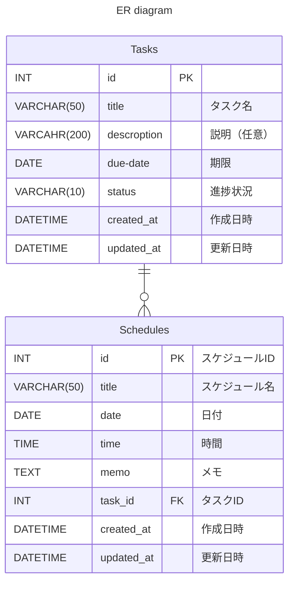

```mermaid
---
title: ER diagram
---
erDiagram
    Tasks ||--o{ Schedules: ""
    Tasks{
        INT id PK
        VARCHAR(50) title "タスク名"
        VARCAHR(200) descroption "説明（任意）"
        DATE due-date "期限"
        VARCHAR(10) status "進捗状況"
        DATETIME created_at "作成日時"
        DATETIME updated_at "更新日時"
    }
    Schedules{
        INT id PK "スケジュールID"
        VARCHAR(50) title "スケジュール名"
        DATE date "日付"
        TIME time "時間"
        TEXT memo "メモ"
        INT task_id FK "タスクID"
        DATETIME created_at "作成日時"
        DATETIME updated_at "更新日時"
        
    }
```